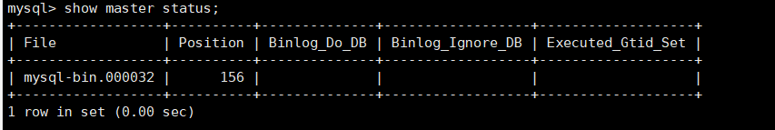

前提：

主服务器：<HOST_IP>:3306 

从服务器：<HOST_IP>:3306 

1. **主服务器备份**

   ```
   xtrabackup --defaults-file=/etc/my.cnf  --socket=/tmp/mysql.sock  --user=bak --password=<PASSWORD> --host=<HOST_IP> --port=3306  --compress  --stream=xbstream  --backup --target-dir=/opt/bak --parallel=2 | ssh root@<HOST_IP> "xbstream -x  -C /opt/bak"
   ```

2. **从服务器恢复备份**

   ```
   #解压缩-使用全量备份文件
   xtrabackup --decompress  --remove-original --target-dir=/opt/bak --parallel=2
   
   #准备备份
   xtrabackup  --prepare --target-dir=/opt/bak --parallel=2
   
   #清空mysql数据文件
   rm -rf /var/lib/mysql/*
   
   #恢复备份-将备份文件移入mysql数据文件中
   rsync -avrP /opt/bak/* --exclude='xtrabackup*' /var/lib/mysql/
   
   #修改文件所属
   chown -R mysql:mysql /var/lib/mysql
   
   #开启mysql服务
   service mysqld start
   
   #查看最后一次增量备份的binlog的position 
   cat /opt/bak/xtrabackup_binlog_info   #(mysql-bin.000031	156)
   
   ```

3. **从服务器修改配置my.cnf**

   ```
   [mysqld]
   server_id = 2   #服务器id，唯一
   
   #中继日志的位置
   relay_log=/var/lib/mysql/mysql-relay-bin
   #允许备库将重要事件记录到自身二进制文件
   log_slave_updates=1
   #阻止没有权限的线程修改数据
   read_only=1
   
   #设置复制函数
   log_bin_trust_function_creators=1
   #设置事件不启用
   event_scheduler=OFF
   
   #开启自动修复机制
   master_info_repository=TABLE
   relay_log_info_repository=TABLE
   relay_log_recovery=1
   
   #设置多线程复制
   slave_parallel_type=LOGICAL_CLOCK
   slave_parallel_workers=3  #线程数 可调节，但不可过大
   slave_preserve_commit_order=1
   ```

4. **重启从服务器mysql服务**

   ```
   service mysqld stop
   service mysqld start
   ```

5. **检查主服务状态**

   ```
   show master status;
   ```

   


6. **检查从服务状态**

   ```
   show slave status\G;
   ```

   


7. **配置主服务链路**

   ```
   change master to master_host='<HOST_IP>',
   master_port=3306,
   master_user='root',
   master_password='<PASSWORD>',
   master_log_file='mysql-bin.000031',
   master_log_pos=156;
   ```

8. **开启主从复制**

   ```
   start slave;
   show slave status\G;
   #可以看到以下参数状态，则为主从复制成功配置
   #Slave_IO_State: Waiting for master to send event
   #Slave_SQL_Running_State: Slave has read all relay log; waiting for more updates
   #Slave_IO_Running: Yes
   #Slave_SQL_Running: Yes
   ```

   
